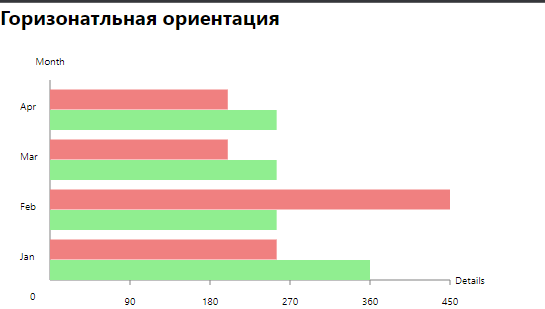
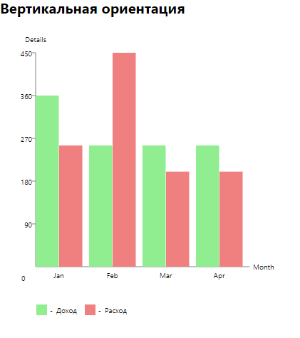

# Компонент BarChart

## Доступные команды

### `yarn start`

Запустить приложение в режиме разработки

### `yarn build`

Сбилдить приложение

Горизонатльная ориентация


Вертикальная ориентация


## Как использовать

Для использования нужно задать ширину, высоту контейнера для графика и передать пропсом `data` данные в виде 
```javascript
  const data = [
    {
      name: 'test 1',
      value: 23,
      фывфвЖ: 78
    },
    {
      name: 'test 2',
      value: 56,
    },
  ];
```
### Обязательное поле `name`.
### Остальные поля должны быть числовыми. Чем больше полей в элементе, тем больше баров будет отрисовано для элемента.

По умолчанию цвета для баров черные.
Можно передать массив цветов `colors`. Бары для элемента будут окрашиваться в порядке цветов массива.
Можно передать массив легенд `legends`. Отображаться будут в порядке 


```javascript
// Пример использования
const Component: FC = () => {
  return (
    <div>
      <BarChart
        orientation="vertical"
        height={400}
        width={400}
        data={mock}
        colors={['lightgreen', 'lightcoral']}
        legends={['Доход', 'Расход']}
        xAxisName="Month"
        yAxisName="Details"
      />
    </div>
  );
};
```

## Входные параметры

| Свойство    | Описание                                | Тип                     | Значение по умолчанию | Обязательное |
| ----------- | --------------------------------------- | ----------------------- | --------------------- | ------------ |
| orientation | Ориентация графика                      | 'vertical' 'horizontal' | 'vertical'            | нет          |
| height      | Высота svg-контейнера                   | number                  | -                     | да           |
| width       | Ширина svg-контейнере                   | number                  | -                     | да           |
| data        | Массив данных для графика               | DataType                | -                     | да           |
| colors      | Массив цветов для отображаемых столбцов | string[]                | -                     | нет          |
| legends     | Массив подписей для столбцов            | string[]                | -                     | нет          |
| xAxisName   | Нименование оси Х                       | string                  | 'x'                   | нет          |
| yAxisName   | Нименование оси Y                       | string                  | 'y'                   | нет          |
